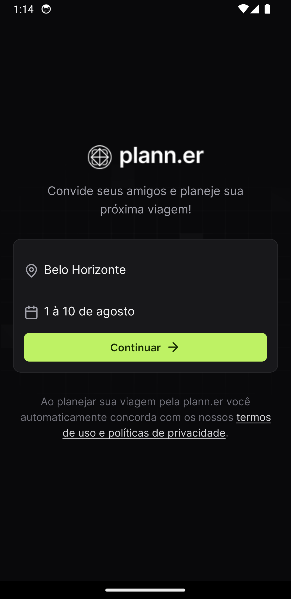
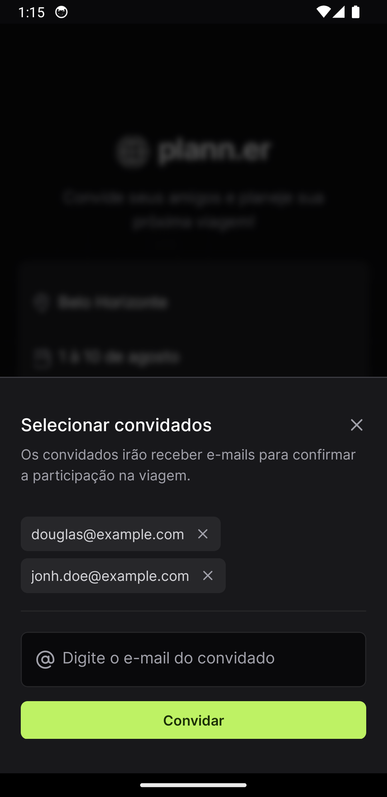
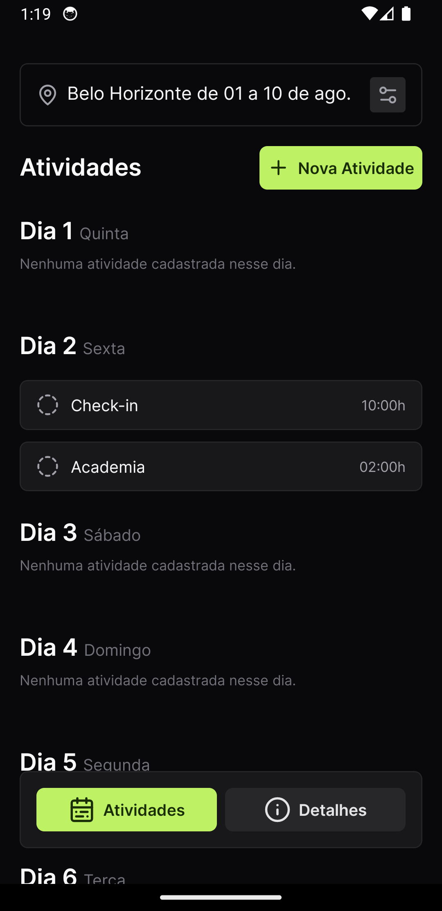
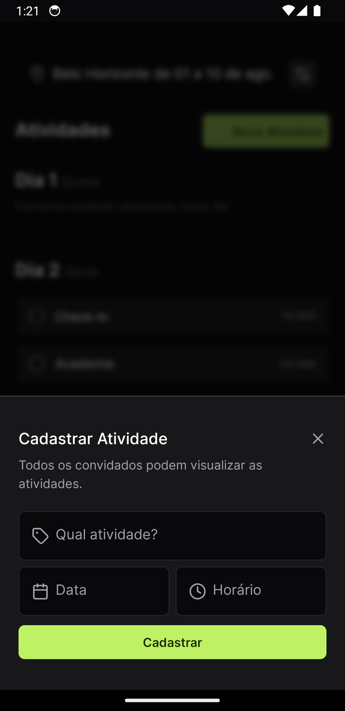
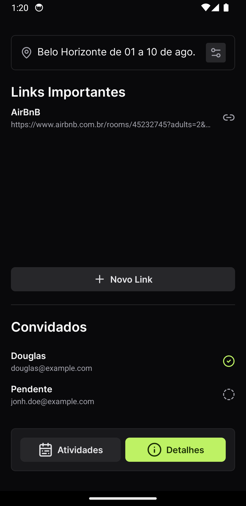
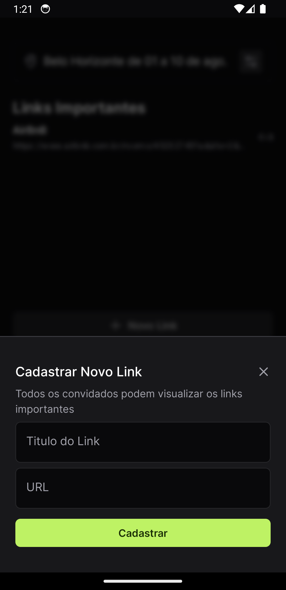

# plann.er
<div style="display: flex; justify-content: center; margin-bottom: 12px;">
    
</div>

<p align="center">Projeto desenvolvido durante a NLW Journey da Rocketseat. 🚀</p>

## Índice
- <a href="#sobre">Sobre</a>
- <a href="#tecnologias-utilizadas">Tecnologias utilizadas</a>
- <a href="#instalação">Instalação</a>

## Sobre

Plann.er é um aplicativo mobile para Android e iOS que facilita o planejamento de viagens em grupo, centralizando envio de convites por e-mail, organização de atividades e análise de sugestões através de links. Permite criar atividades durante o período da viagem, anexar links para comparações de serviços oferecendo uma uma interface amigável. Proporciona uma experiência colaborativa e eficiente para uma viagem memorável.








## Tecnologias Utilizadas
### Mobile

<div style="display: flex; justify-content: between; gap: 8px; align-items: center; margin-bottom: 12px;">
    
    
    
    
    
    
</div>

### Server

<div style="display: flex; justify-content: between; gap: 8px; align-items: center; margin-bottom: 12px;">
    
    
    
    
    
    
</div>

## Instalação
### Server
Para instalar todas as dependecias, rode o comando na pasta /server do projeto plann.er: 
```bash
    npm install
```

Inicialize o banco de dados do servidor através do seguinte comando:
```bash
    npm run db:init
```

Para inicializar o servidor em modo de desenvolvimento, rode o comando:
```bash
    npm run dev
```

Para abrir o banco de dados através do Studio da biblioteca Prisma, rode o comando: 
```bash
    npm run db:studio
```

### Mobile
Para instalar todas as dependecias, rode o comando na pasta /mobile do projeto plann.er: 
```bash
    npm install
```

Antes de inicializar a aplicação, coloque o IP local da sua máquina no seguinte arquivo `/mobile/src/server/api.ts`:

<div style="display: flex; justify-content: center;margin-bottom: 12px;">
    
</div>

Para inicializar o servidor mobile, rode o comando: 
```bash
    npm start
```

Caso já use o emulador do Android Studio, deixe o emulador inicializado e tecle o comando `a` em seu terminal para abrir o aplicativo. 

É possível também, baixar o app Expo Go em sua loja de aplicativos (Apple Store ou PlayStore) e scannear o QRCode gerado a partir do comando `npm start` para abrir o aplicativo no celular. Portanto, é importante estar conectado na mesma rede da máquina onde o servidor do projeto está rodando.  